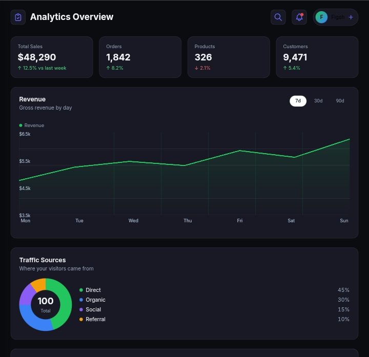

# Templates

Ready-made UI samples using **st-core@v2** and related FSCSS modules.

| Template | Description |
|----------|-------------|
| [admin-dashboard](./admin-dashboard/) | Analytics shell: chart, pie, goals, lists, table |

Add React/Next variants later; start from the HTML split (`*.fscss` / `*.css` / `*.js`).
