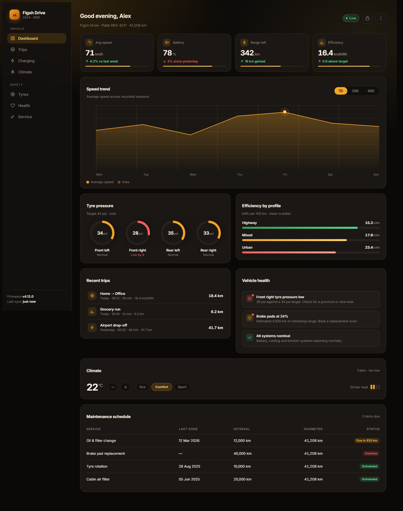

# Connected car dashboard template

[](https://hub.devtem.org/st-core.fscss/templates/car-dashboard/)

HTML + FSCSS template built on:

| Module | Role |
|--------|------|
| [st-core@v2](https://github.com/fscss-ttr/st-core.fscss) | Tokens, speed chart (`clip-path` + `--st-pN`), category bars (`@st-cat-bar-fill`), tire dials |

Dark amber telemetry shell: responsive sidebar (off-canvas + swipe), stat row, multi-range speed chart, tire-pressure dials, efficiency bars, trip log, health alerts, climate controls, lock, and a maintenance table.

---

## Files

```text
templates/car-dashboard/
├── README.md
├── index.html      # markup + compiled CSS link
├── car.fscss       # source styles + module imports
├── car.css         # CLI output (generate this)
├── car.js          # tabs, peak marker, drawer, climate, lock
├── verify.js       # static checks (optional)
└── car.jpg         # preview
```

---

## Quick preview (runtime)

Serve the folder (paths need a local server):

```bash
npx serve .
# open index.html — uses fscss@1.2.4 runtime + link type="text/fscss"
```

---

## Production (compiled CSS)

```bash
npm install -g fscss@1.2.4
fscss car.fscss car.css
```

In `index.html`, switch to:

```html
<link rel="stylesheet" href="car.css">
```

JS only sets chart variables and UI state — geometry stays in compiled CSS (same pattern as [admin-dashboard](../admin-dashboard/) and [integration/svelte](../../integration/svelte)).

---

## Multi-range chart geometry

> This template resolves the compile-time polygon limitation noted in the [admin-dashboard README](../admin-dashboard/README.md#production-compiled-css).

Chart polygon length is fixed at compile time from `@arr` length, so a 7-point range compiles to a 9-stop fill polygon and a 15-stop line polygon. **One shared array cannot serve three ranges.** Each range therefore gets its own array *and* its own chart classes:

| Range | Points | Fill stops | Line stops | Grid columns |
|-------|--------|-----------|------------|--------------|
| 7D    | 7      | 9         | 15         | 7            |
| 30D   | 10     | 12        | 21         | 10           |
| 90D   | 12     | 14        | 25         | 12           |

```fscss
.speed-7d{
  @st-chart-points(speed-7d)
  @st-chart-fill(.speed-fill-7d, speed-7d)
  @st-chart-line(.speed-line-7d, speed-7d)
  @st-chart-grid(.speed-grid-7d, 5, 7)
}
```

`@st-chart-points` takes **no selector argument** — it must be called *inside* a rule, otherwise its `--st-p*` declarations have no rule to land in. Each range is scoped to its own container so the three never overwrite each other's custom properties.

`car.js` keeps a `SERIES` copy of the arrays because it positions the peak marker at runtime; `verify.js` asserts the two stay in sync.

---

## Three FSCSS traps

Each produced a *plausible-looking but broken* stylesheet, so none were caught by eyeballing the source. All three were verified in Chrome.

**1. `@st-root()` emits its own `:root{}` rule.** Calling it inside `body{}` compiles to `body :root{…}` — a descendant selector that never matches. Chrome also discards declarations written *after* a nested block, so `color`, `background` and `font-family` were dropped too. Symptom: unstyled page (transparent backgrounds, serif fallback, zero radii) while every literal-value rule kept working. **Call it at the top level.**

**2. A trailing `;` on a bare top-level call emits a stray `;` between rules.** Chrome discards the style rule that *follows* one. This hit the efficiency bars: only the first got a width, the rest silently rendered at 100%. Confirmed with an A/B test in Chrome. **Do not terminate bare top-level calls or `@arr` declarations with `;`.**

**3. Helpers that take a selector emit a *complete* rule for it.** Wrapping `@st-cat-bar-fill(.bar-urban, 68)` in an extra `.bar-urban{ … }` produced `.bar-urban .bar-urban` — again a descendant selector, again no width. **Call it bare.**

Also worth knowing: **a failed remote import still reports `✔ Compiled`**, emitting `/* Failed import: … */` and a stylesheet with no tokens and no chart helpers at all. `verify.js` checks for that marker first.

---

## Icons

This template keeps **inline stroked SVG** rather than [icon-mask](https://github.com/fscss-ttr/icon-mask.fscss), unlike [budget-app](../budget-app/). Two reasons:

- `icon-mask` covers 4 of the 7 nav icons here (`@icon-chart`, `@icon-clock`, `@icon-alert`, `@icon-settings`) but has no bolt, thermometer or tyre. Substituting generic icons would lose the vehicle-specific meaning.
- `icon-mask` renders as a mask image tinted with `background-color`, while these icons are 2px stroked outlines. Mixing the two in one nav produces visibly inconsistent weight.


---

## Checks

`verify.js` is optional and self-contained — no test runner needed:

```bash
node verify.js
```

40 static checks: JS/FSCSS array sync, chart stop counts, axis-label counts, ARIA wiring, token leakage, failed-import detection, and guards against the three traps above.

Computed styles were additionally confirmed in headless Chrome (bar widths 68 / 84 / 76 %, amber token values, per-range `clip-path` and peak marker). That probe used a Windows-specific Chrome path, so it is not included here.

---

## License

Same as st-core / FSCSS samples (MIT).
